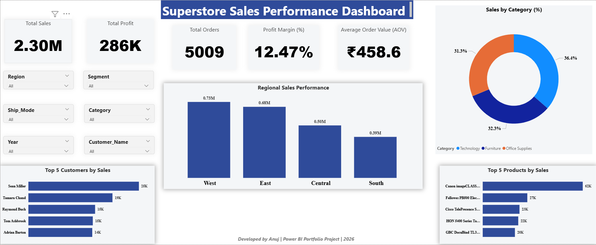

# 📊 Superstore Sales Analytics Dashboard

## 🚀 Project Overview
This project demonstrates end-to-end Sales Performance Analysis using SQL, Excel, and Power BI.

The objective was to transform raw transactional data into meaningful business insights through interactive dashboards and KPI analysis.

---

## 🛠 Tools & Technologies Used
- SQL Server
- Microsoft Excel
- Power BI
- DAX (Time Intelligence Functions)

---

## 📈 Executive Dashboard Features
- Total Sales
- Total Profit
- Profit Margin %
- Average Order Value (AOV)
- Regional Sales Analysis
- Category Contribution (Donut Chart)
- Top 5 Customers
- Top 5 Products
- Interactive Slicers

---

## 📅 Time & Trend Analysis
- YTD Sales & Profit
- Year-over-Year Growth %
- Monthly Growth %
- Sales vs Profit Trend
- Decomposition Tree Analysis

---

## 📊 Key Insights
- West region generated highest revenue.
- Technology category contributed maximum sales.
- Seasonal spikes observed during Q4.
- Discount-heavy segments showed reduced profitability.

---

## 🎯 Skills Demonstrated
- SQL-based Data Analysis
- KPI & Business Metrics Calculation
- DAX Time Intelligence
- Interactive Dashboard Design
- Data-Driven Decision Making

---

## 📁 Project Structure
superstore-sales-analytics-dashboard/
│
├── Superstore_Data.csv
├── Superstore_Excel_Dashboard.xlsx
├── Superstore_SQL_Analysis.sql
├── Superstore_Sales_Dashboard.pbix
├── README.md
└── Project_Documentation/
        └── Project_Overview.txt

## Dashboard Preview

## Dashboard Preview
Sale_Analysis_Dashboard.png
